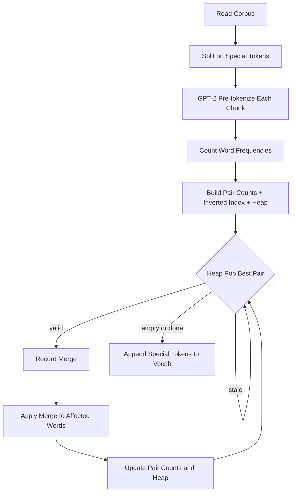
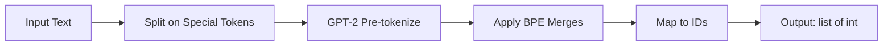

# BPE Tokenizer Training: Implementation Walkthrough

## Overview

This document summarizes the implementation of BPE (Byte Pair Encoding) training
for CS336 Assignment 1. The task: given a text corpus, iteratively merge the most
frequent adjacent byte pairs to build a vocabulary of a target size.

## Architecture

The final implementation uses three key data structures maintained incrementally:

| Structure | Type | Purpose |
|-----------|------|---------|
| **word_freqs** | `dict[tuple[int], int]` | Maps tokenized words to corpus frequency |
| **pair_index** | `dict[pair, set[word]]` | Inverted index: which words contain each pair |
| **heap** | `list[(-count, Negated(bytes), pair)]` | Lazy max-heap for O(log P) best-pair selection |



---

## Phase 1: Bug Hunt (Code Review Exercise)

Started with a deliberately buggy implementation to test understanding.

### Bug 1: Merge Skip Count

When merging pair (A, B) into AB, the pointer must advance by **2**, not 1:

```diff
  if word[i] == left and word[i+1] == right:
      new_word.append(new_token_id)
-     i += 1   # only skips left token
+     i += 2   # skip BOTH tokens of merged pair
```

**Symptom**: Merged tokens overlap with subsequent pairs, corrupting words.

### Bug 2: Special Token Leakage

Special tokens (e.g. `<|endoftext|>`) must be **split out of text before
pre-tokenization**. Otherwise their constituent bytes participate in merges
and leak into the vocabulary.

**Fix**: Use `regex.split()` to remove special tokens from text, pre-tokenize
each remaining chunk separately.

```python
def _split_on_special_tokens(text, special_tokens):
    sorted_specials = sorted(special_tokens, key=len, reverse=True)
    escaped = [regex.escape(st) for st in sorted_specials]
    pattern = "|".join(escaped)
    chunks = regex.split(pattern, text)
    return [c for c in chunks if c]
```
---

## Phase 2: The Tie-Breaking Saga (Hardest Part)

This consumed the most debugging time. When two pairs have identical frequency,
`max()` breaks ties by **Python dict iteration order**, which depends on insertion
order. The reference implementation expects a specific deterministic result.

### Attempt 1: No tie-breaking

Used `max(pair_counts, key=lambda p: pair_counts[p])`.

Matched reference for 50 merges, **diverged at index 64**.

### Attempt 2: Token-ID tie-breaking

Used `max(..., key=lambda p: (count, p))` where `p` is a tuple of int IDs.

Fixed through index 91, **failed at index 92**.

> **Root cause**: Compound tokens get IDs > 256 that do not sort the same as
> their byte content. E.g. token 258 (representing " c") numerically beats
> token 116 (representing "t"), but by byte content `b" c" < b"t"`.

### Attempt 3: Byte-content tie-breaking (correct)

Used `max(..., key=lambda p: (count, (left_bytes, right_bytes)))`.

Python's `bytes` comparison handles variable-length correctly:
`b" " < b" a"` (shorter prefix is smaller).

```python
best_pair = max(pair_counts, key=lambda p: (
    pair_counts[p],
    (token_bytes_map[p[0]], token_bytes_map[p[1]])
))
```

**All 243 merges matched the reference.**

## Phase 3: Performance Optimization

### Profiling (Scalene)

Baseline: **67.5s** for 10k vocab on TinyStories-valid (5MB).

| Line | CPU % | Operation |
|------|-------|-----------|
| `max(pair_counts, ...)` | **40.8%** | Scanning ALL pairs every iteration |
| `word_freqs[byte_seq] += 1` | 24.6% | Pre-tokenization counting (one-time) |
| `regex.findall(...)` | 19.8% | GPT-2 regex (one-time, runs in C) |

### Optimization: Lazy Max-Heap

Replaced the O(P) `max()` scan with a **lazy max-heap** using `heapq`.

**Key design decisions:**

1. **`_Negated` wrapper class** for max-heap behavior:

   ```python
   class _Negated:
       __slots__ = ("val",)
       def __init__(self, val): self.val = val
       def __lt__(self, other): return self.val > other.val
   ```

   Simple byte-value negation (`255 - b`) was tried first but failed because
   it does not correctly invert length-based comparison of bytes objects.

2. **Lazy invalidation**: When popping, verify the count still matches
   `pair_counts`. Stale entries are silently discarded.

3. **Re-push on decrement**: When a pair's count decreases, push a new entry.
   Without this, decremented pairs become invisible to the heap.

### Results

| Metric | Before | After | Speedup |
|--------|--------|-------|---------|
| 10k vocab on TinyStories | 67.5s | 23.4s | **2.88x** |
| test_train_bpe_speed | PASS | PASS | -- |
| test_train_bpe | PASS | PASS | -- |
| test_train_bpe_special_tokens | PASS | PASS | -- |

---

## Phase 4: Tokenizer Class (Encode / Decode)

The tokenizer **reuses the same pipeline** from BPE training:



### Encode

1. Split text on special tokens (longest-first regex, same as training)
2. GPT-2 pre-tokenize each non-special chunk
3. For each pre-token, apply BPE merges in **priority order** (lowest rank first):
   ```python
   # Start with individual bytes: [b'H', b'e', b'l', b'l', b'o']
   # Find lowest-rank mergeable pair, merge it, repeat
   while len(parts) > 1:
       best = min mergeable pair by rank
       parts = merge(best)
   # Result: [b'Hello'] -> look up ID
   ```
4. Special tokens map directly to their ID (no merging)

### Decode

Simply `vocab[id]` for each ID, concatenate bytes, decode UTF-8.

### encode_iterable (streaming)

A generator that processes one chunk at a time from an iterable (e.g. file lines),
yielding IDs without loading the full text into memory. Passes the <1MB memory test.

### Key insight

The tokenizer is the **inverse of training**: training discovers *which* merges to make
(and in what order), the tokenizer *applies* those merges to new text. Both share
the same pre-tokenization regex and special token handling.

---

## Lessons Learned

1. **Tie-breaking in BPE is implementation-critical.** Dict iteration order,
   token IDs, and byte content all give different results. The only reliable
   debugging method was step-by-step comparison with the reference.

2. **Heap + lazy deletion** is a powerful pattern. Never delete from the heap --
   let stale entries accumulate and skip them on pop.

3. **Profile before optimizing.** The inverted index alone was not enough --
   `max()` was still 41% of CPU. Only profiling identified the right target.

4. **Special tokens are a text-level concern.** They must be isolated from text
   before any tokenization occurs, not handled after the fact.
