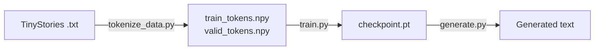

# Training & Generation: Implementation Walkthrough

## Overview

This document summarizes the training loop, data pipeline, and text generation
for CS336 Assignment 1. The task: tokenize TinyStories, train a 22.7M-parameter
decoder-only Transformer, and generate text from the trained model.

Three source files, building on top of the existing model, optimizer, and tokenizer:

| File | Purpose |
|------|---------|
| `tokenize_data.py` | Raw text → numpy token arrays for memmap loading |
| `train.py` | Training loop: batching, cosine LR, gradient clipping, checkpointing |
| `generate.py` | Text decoding: temperature scaling, top-p sampling, autoregressive loop |



---

## Part 1: Data Tokenization Pipeline

### Loading Serialized Vocab & Merges

The BPE tokenizer was trained in a previous step and serialized to two files.
Loading them back requires parsing two formats:

```python
# Vocab: {str(id): list_of_byte_values}
vocab = {int(k): bytes(v) for k, v in json.load(f).items()}

# Merges: repr'd bytes literals, e.g. b' ' b't'
# Regex handles escape sequences like b'\n' correctly
bytes_literal_re = re.compile(r"""b(?:'[^'\\]*(?:\\.[^'\\]*)*'|"[^"\\]*(?:\\.[^"\\]*)*")""")
matches = bytes_literal_re.findall(line)
left, right = ast.literal_eval(matches[0]), ast.literal_eval(matches[1])
```

> **Gotcha**: The naive approach of splitting on `" b'"` breaks on
> lines like `b'\n' b'\n'` — the escape sequence contains `'` characters.
> A regex matching complete Python bytes literals is the robust solution.

### Stream Tokenization

Uses `Tokenizer.encode_iterable` to process the file line-by-line,
avoiding loading the full 2.2GB text into memory:

```python
def line_iter():
    with open(input_path, "r") as f:
        for line in f:
            yield line

tokens = list(tokenizer.encode_iterable(line_iter()))
np.save(output_path, np.array(tokens, dtype=np.uint16))
```

Stored as `uint16` — sufficient for vocab_size=10,000 (max representable: 65,535).

### Results

| Split | File Size | Tokens |
|-------|-----------|--------|
| Valid | 22 MB | 5,461,210 |
| Train | 2.2 GB | (pending — takes ~30 min) |

---

## Part 2: Training Loop

### Architecture

The training loop follows a standard pattern — nothing unusual — but wires
together every component built in previous assignments:

```python
for step in range(num_steps):
    # 1. Update LR via cosine schedule
    lr = get_lr_cosine_schedule(step, max_lr, min_lr, warmup, total_steps)
    for pg in optimizer.param_groups:
        pg["lr"] = lr

    # 2. Sample batch (memmap → tensor → .long())
    x, y = get_batch(train_data, batch_size, context_length, device)
    x, y = x.long(), y.long()

    # 3. Forward + loss
    logits = model(x)
    loss = cross_entropy(logits.reshape(-1, vocab_size), y.reshape(-1))

    # 4. Backward + clip + step
    loss.backward()
    gradient_clipping(model.parameters(), max_norm=1.0)
    optimizer.step()
    optimizer.zero_grad()
```

> **uint16 → long cast**: `get_batch` returns tensors matching the numpy dtype.
> Memmap'ed `uint16` arrays produce `torch.int16` tensors, but `Embedding.forward`
> uses indexing which requires `long`. The `.long()` cast is essential.

### LR Schedule (External)

The learning rate is controlled *outside* AdamW — the optimizer receives its
LR through `param_groups["lr"]` each step. This makes the cosine schedule
explicit and easy to log:

```python
# Three phases: warmup → cosine decay → hold at min
if step < warmup:       lr = max_lr * step / warmup
elif step < total:      lr = min_lr + 0.5*(max_lr - min_lr)*(1 + cos(π*progress))
else:                   lr = min_lr
```

### Evaluation

Validation loss is estimated over 20 random batches from the val set.
The model switches to `eval()` mode (disabling any stochastic layers)
then back to `train()`:

```python
@torch.no_grad()
def evaluate(model, val_data, batch_size, context_length, device, eval_batches=20):
    model.eval()
    total_loss = sum(
        cross_entropy(model(x).reshape(-1, V), y.reshape(-1)).item()
        for x, y in batches
    )
    model.train()
    return total_loss / eval_batches
```

### Hyperparameters (Low-Resource)

| Parameter | Value | Notes |
|-----------|-------|-------|
| vocab_size | 10,000 | BPE on TinyStories |
| context_length | 256 | |
| d_model | 512 | |
| d_ff | 1,344 | Smaller than typical 4×d_model |
| num_layers | 4 | |
| num_heads | 16 | d_k = 32 |
| batch_size | 32 | |
| num_steps | 4,883 | 40M tokens / (32 × 256) |
| max_lr | 1e-3 | |
| min_lr | 1e-4 | |
| warmup | 500 steps | |
| grad_clip | 1.0 | L2 norm |
| **Target** | **val_loss ≤ 2.00** | |

Total params: **22,696,448** (17,576,448 non-embedding).

### MPS / CPU Notes

- `torch.compile(model, backend="aot_eager")` for Apple MPS
- `torch.compile(model)` for CPU (default Inductor)
- Do NOT use `torch.set_float32_matmul_precision('high')` on MPS

---

## Part 3: Text Generation

### Temperature Scaling

Divide logits by temperature τ before softmax — lower τ sharpens the
distribution (more deterministic), higher τ flattens it (more random):

```python
P(x_i | x_{1:i-1}) = softmax(z_i / τ)
```

### Top-p (Nucleus) Sampling

Keep the smallest set of tokens whose cumulative probability ≥ p,
set everything else to −∞, then renormalize and sample:

```python
def top_p_filter(logits, top_p):
    sorted_logits, sorted_indices = torch.sort(logits, descending=True)
    probs = softmax(sorted_logits, dim=-1)
    cumulative = torch.cumsum(probs, dim=-1)

    # Mask tokens that push cumulative prob past top_p
    mask = cumulative - probs >= top_p
    sorted_logits[mask] = -inf

    # Scatter back to original order
    filtered = torch.empty_like(logits)
    filtered.scatter_(dim=-1, index=sorted_indices, src=sorted_logits)
    return filtered
```

> **Key subtlety**: The mask is `cumulative - probs >= top_p`, not
> `cumulative >= top_p`. Subtracting `probs` ensures we *include* the
> token that crosses the threshold, not exclude it.

### Autoregressive Loop

```python
for _ in range(max_tokens):
    context = generated[-context_length:]       # sliding window
    logits = model(tensor([context]))           # (1, seq, vocab)
    next_logits = logits[0, -1, :] / temperature
    next_logits = top_p_filter(next_logits, top_p)
    next_token = multinomial(softmax(next_logits), 1)

    if next_token == eot_id:
        break
    generated.append(next_token)
```

Stop conditions: hit the end-of-text token, or reach `max_tokens`.

---

## Pipeline Verification

### Tests: 46 passed, 2 skipped

All existing tests remain green — no regressions.

### End-to-End Check

| Check | Result |
|-------|--------|
| Tokenizer load | 10,000 tokens, 9,743 merges ✅ |
| Valid tokenization | 5,461,210 tokens, uint16, max_id=9999 ✅ |
| Model construction | 22,696,448 params (17.6M non-emb) ✅ |
| Initial loss | 9.21 ≈ ln(10000) ✅ |
| Train step | forward + backward + clip + AdamW ✅ |
| Generation (untrained) | Produces tokens (gibberish, as expected) ✅ |
| Checkpoint roundtrip | save → load → weights match ✅ |

---

## Lessons Learned

1. **Dtype matters for memmap.** `uint16` numpy arrays produce `int16`
   PyTorch tensors. Embedding indexing requires `long` — a silent shape
   mismatch that only surfaces with real data, not test fixtures.

2. **Parsing repr'd bytes needs care.** Naive string splitting breaks on
   escape sequences like `\n`. Regex matching complete Python literals
   (with proper backslash escaping) is the robust approach.

3. **LR lives outside the optimizer.** The cosine schedule updates
   `param_groups["lr"]` each step, keeping AdamW's weight decay
   correctly decoupled (it uses `lr * weight_decay`, not `scheduled_lr`).

4. **Top-p mask is `cumulative - probs ≥ p`, not `cumulative ≥ p`.**
   The subtraction ensures the token that crosses the threshold is
   included in the nucleus set.
