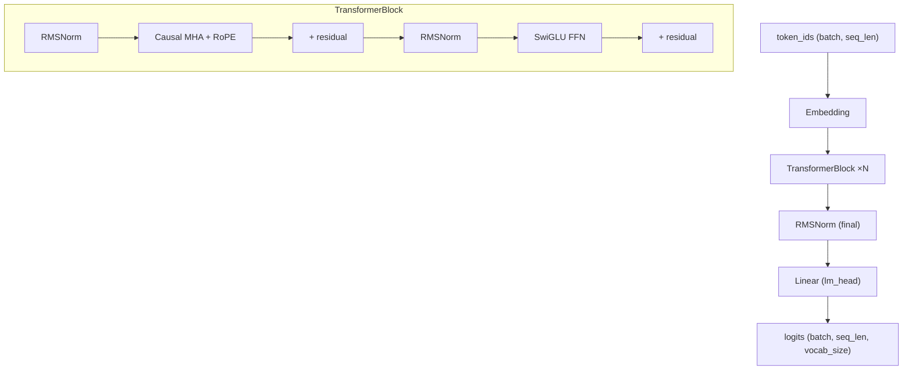

# Transformer: Implementation Walkthrough

## Overview

This document summarizes the implementation of the Transformer language model
for CS336 Assignment 1. The task: build a decoder-only Transformer (LLaMA-style)
from scratch — embedding, attention, RoPE, feed-forward, optimizer, and training
utilities.

## Architecture

Three source files, 16 components, all tested against reference snapshots:

| File | Components |
|------|-----------|
| `model.py` | Linear, Embedding, RMSNorm, SiLU, SwiGLU, SDPA, RoPE, MHA, TransformerBlock, TransformerLM |
| `nn_utils.py` | softmax, cross_entropy, gradient_clipping, get_batch, cosine LR schedule |
| `optimizer.py` | AdamW, checkpoint save/load |



---

## Part 1: Foundational Primitives

### Linear (no bias)

Stores weight W ∈ ℝ^{d_out × d_in}, computes y = Wx using einsum:

```python
def forward(self, x):
    return einsum(x, self.weight, "... d_in, d_out d_in -> ... d_out")
```

No `nn.Linear` or `nn.functional.linear` used — pure parameter + einsum.

### Numerically Stable Softmax & Cross-Entropy

Both subtract the max before exponentiation to prevent overflow:

```python
# softmax: subtract max, then exp/sum
x_max = x.max(dim=dim, keepdim=True).values
exp_x = torch.exp(x - x_max)
return exp_x / exp_x.sum(dim=dim, keepdim=True)

# cross_entropy: cancel log and exp for stability
log_sum_exp = torch.log(torch.exp(inputs - x_max).sum(...)) + x_max
log_probs = inputs - log_sum_exp
```

### RMSNorm

Simpler than LayerNorm — no mean subtraction, just scale by root-mean-square:

```python
rms = torch.sqrt(x.pow(2).mean(dim=-1, keepdim=True) + eps)
return x / rms * self.weight
```

---

## Part 2: Attention Components

### Scaled Dot-Product Attention

Core attention using einsum for self-documenting shapes:

```python
# QK^T: "... queries d_k, ... keys d_k -> ... queries keys"
scores = einsum(Q, K, "... queries d_k, ... keys d_k -> ... queries keys")
scores = scores / sqrt(d_k)
scores = scores.masked_fill(~mask, -inf)       # causal masking
attn = softmax(scores, dim=-1)

# weighted sum: "... queries keys, ... keys d_v -> ... queries d_v"
return einsum(attn, V, "... queries keys, ... keys d_v -> ... queries d_v")
```

Supports arbitrary batch dimensions via `...` — works for both 3D (batch, seq, d)
and 4D (batch, heads, seq, d) inputs.

### RoPE (Rotary Position Embeddings)

Precomputes cos/sin tables, applies 2D rotation to even/odd pairs:

```python
# Precompute: θ_k = 1/Θ^{2k/d}
freqs = 1.0 / (theta ** (torch.arange(0, d_k, 2) / d_k))
angles = torch.outer(positions, freqs)          # (max_seq_len, d/2)

# Apply: rotate (x_even, x_odd) by angle at each position
out_even = x_even * cos - x_odd * sin
out_odd  = x_even * sin + x_odd * cos
return rearrange(torch.stack((out_even, out_odd), dim=-1),
                 "... d_half pair -> ... (d_half pair)")
```

> **Key insight**: RoPE has no learnable parameters — registered as buffers.
> A single RoPE instance is shared across all layers (same rotation per head).

### SwiGLU Feed-Forward

Three linear layers, SiLU activation with gating:

```python
# FFN(x) = W2(SiLU(W1·x) ⊙ W3·x)
def forward(self, x):
    return self.w2(silu(self.w1(x)) * self.w3(x))
```

---

## Part 3: Causal Multi-Head Attention

This was the trickiest component. The assignment says
"Implement **causal** multi-head self-attention" — meaning the causal mask
must be built into MHA, not passed from outside.

### Head Splitting with Rearrange

```python
# Project all heads in one matmul, then split
Q = self.q_proj(x)  # (batch, seq, d_model)
Q = rearrange(Q, "batch seq (heads d_k) -> batch heads seq d_k", heads=num_heads)
```

### Causal Mask (Built-In)

```python
causal_mask = torch.tril(torch.ones(seq_len, seq_len, dtype=torch.bool))
out = scaled_dot_product_attention(Q, K, V, causal_mask)
```

### Head Concatenation

```python
out = rearrange(out, "batch heads seq d_k -> batch seq (heads d_k)")
out = self.output_proj(out)
```

> **Debugging note**: The initial implementation didn't include causal masking
> in the standalone MHA module — the test failed with 91.7% element mismatch.
> Re-reading the spec ("Implement **causal** multi-head self-attention")
> immediately identified the fix.

---

## Part 4: Full Transformer Assembly

### TransformerBlock (Pre-norm)

Two sublayers, each with RMSNorm → operation → residual:

```python
x = x + self.attn(self.ln1(x), rope=self.rope, token_positions=positions)
x = x + self.ffn(self.ln2(x))
```

### TransformerLM

The complete forward pass:

```python
x = self.token_embeddings(token_ids)            # (batch, seq) → (batch, seq, d_model)
for layer in self.layers:
    x = layer(x, token_positions=positions)      # N × TransformerBlock
x = self.ln_final(x)                            # final RMSNorm
logits = self.lm_head(x)                        # (batch, seq, vocab_size)
```

### Weight Naming Convention

Module names match the reference state dict exactly so `load_state_dict` works:

```
token_embeddings.weight         layers.{i}.attn.q_proj.weight
layers.{i}.ln1.weight           layers.{i}.attn.k_proj.weight
layers.{i}.ln2.weight           layers.{i}.attn.v_proj.weight
layers.{i}.ffn.w1.weight        layers.{i}.attn.output_proj.weight
layers.{i}.ffn.w2.weight        ln_final.weight
layers.{i}.ffn.w3.weight        lm_head.weight
```

---

## Part 5: Optimizer & Training Utilities

### AdamW

Follows Algorithm 1 from the assignment (Loshchilov & Hutter, 2019):

```python
m = β1*m + (1-β1)*g          # first moment
v = β2*v + (1-β2)*g²         # second moment
αt = α * √(1-β2^t)/(1-β1^t)  # bias-corrected LR
θ -= αt * m/(√v + ε)          # Adam step
θ -= α * λ * θ                # decoupled weight decay
```

> **Subtlety**: The spec absorbs bias correction into the learning rate
> (`αt`), rather than correcting m and v separately. Mathematically equivalent,
> but floating-point behavior can differ — the test accepts either approach.

### Cosine LR Schedule

Three phases: linear warmup → cosine decay → hold at min:

```python
if it < warmup_iters:              α = αmax * it / Tw
elif it < cosine_cycle_iters:      α = αmin + ½(αmax - αmin)(1 + cos(π·progress))
else:                              α = αmin
```

### Checkpoint Save/Load

Simple `torch.save` / `torch.load` of a dict containing model state,
optimizer state, and iteration number.

---

## Test Results

All **20 tests** pass:

| Suite | Tests | Status |
|-------|-------|--------|
| test_model.py | 13 (linear, embedding, silu, swiglu, rmsnorm, rope, sdpa, 4d_sdpa, mha, mha_rope, block, lm, lm_truncated) | ✅ |
| test_nn_utils.py | 3 (softmax, cross_entropy, gradient_clipping) | ✅ |
| test_optimizer.py | 2 (adamw, lr_schedule) | ✅ |
| test_data.py | 1 (get_batch) | ✅ |
| test_serialization.py | 1 (checkpointing) | ✅ |

---

## Lessons Learned

1. **Read the spec literally.** "Implement **causal** multi-head self-attention"
   means the causal mask is part of the MHA module — not passed in by the caller.
   Missing this caused 91.7% element mismatch.

2. **Einsum is documentation.** `"... queries d_k, ... keys d_k -> ... queries keys"`
   tells you exactly what's happening — no need for shape comments.

3. **Weight naming matters.** Naming module attributes to match the reference
   state dict (`attn.q_proj.weight`, `ffn.w1.weight`) means `load_state_dict`
   works directly in the test adapters.

4. **One RoPE, many layers.** RoPE has no parameters — a single instance
   shared across all layers saves memory and keeps cos/sin tables consistent.
